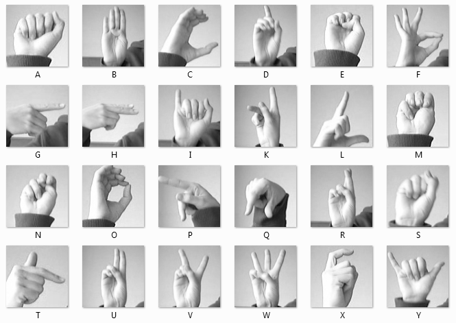
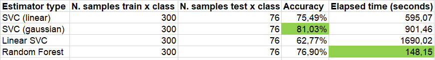
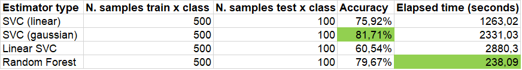
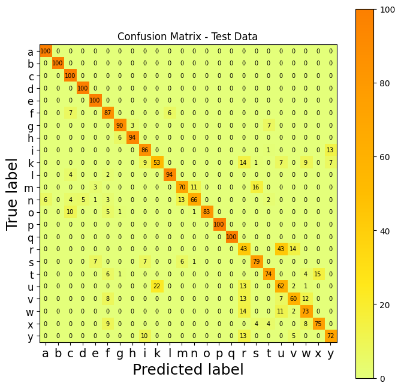
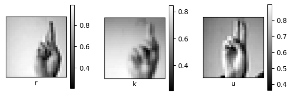

Sign Language Classification
==============================

Project for the MACHINE LEARNING AND DATA ANALYSIS (Machine Learning for Robotics II) course at [University of Genoa](https://unige.it//).

Authors: Claudio Del Gaizo (s4696649), Thomas Campagnolo (s5343274)

Professor: [Luca Oneto](luca.oneto@unige.it) 

Contents
----------------
* [Introduction](#introduction)
    * [Scenario Description](#scenario-description)
    * [Motivations](#motivations)
    * [Dataset](#dataset)
    * [Custom Subdataset](#custom-subdataset)
* [Setup Environment and How to Run](#setup-environment-and-how-to-run)
* [Classification Models](#classification-models)
* [Results](#results)
* [System's features & Improvements](#systems-features--improvements)


Introduction
-----------------

### Scenario Description

Sign language recognition and classification using machine learning in social robots can be used in contexts of interaction with deaf-mute people. They use sign language as their primary form of communication. Integrating sign language capability into social robots allows them to communicate more effectively, creating a more natural and fluid interaction. A second important aspect is accessibility. Social robots can act as intermediaries between deaf-mute people and the outside world, helping them communicate with other people, access information and solve everyday problems.

Unfortunately deaf-mute people often face challenges in social interaction due to language barriers. Social robots that can communicate using sign language can help overcome these barriers, fostering social interaction and reducing the social isolation that people with hearing impairments often experience.

Machine learning and classification techniques can be used to train social robots to recognize gestures and sign language expressions. This requires building annotated datasets containing images or videos of sign language gestures and training machine learning models to recognize them in real time.

The use of sign language in social robots promotes accessibility, autonomy and the reduction of social isolation for people with hearing impairments, enabling them to participate more fully in society.

### Motivations
Although in natural applications, like images recognition, Deep Learning is more suggested, this project has the goal of understanding and comparing some Machine Learning estimators for image classification, in order to find (if existing) possible solutions capable of solving this specific problem. 

Despite of the known limitations of ML algorithms in complex image recognition problems, the methods analyzed nonetheless present considerable results.


### Dataset

For this project the original dataset is the [Sign Language MNIST Dataset](https://www.kaggle.com/datasets/datamunge/sign-language-mnist). 

The dataset format consists of a training set and a test set represented by a label (0-25) as a one-to-one map for each alphabetic letter A-Z. Due to the gesture movements to make the letter J (9) and Z (25), no instances of these two are present in the datasets.

The training data (27455 cases) and test data (7172 cases) are about half the size of the standard MNIST but otherwise similar with a label header row, pixel1,pixel2….pixel784 representing a single image of 28x28 pixels with grayscale values between 0-255.



For more information please refer to the dataset link above.

### Custom Subdataset

<!-- descrizione nella generazione del subdataset -->
In order to have a better dataset for applying machine learning algorithms of classification, the original dataset was reduced into a smaller one, regarding both the training and the test set. To this aim, a specific number of samples for each of the 24 classes were extracted from the original database. This allowed to obtain a balanced subdataset, since every class presents the same amount of samples, and at the same time, to maintain an acceptable proportion between the training and test set size (about 80% for training and 20% for testing). More in detail two different sizes were tested, a first one containing 7200 images in the training set (300 per class) and 1824 in the test set (76 per class), and a second bigger one having 12000 images for training (500 per class) and 2400 for testing (100 per class). Such dimensions reduced the computational complexity of the problem, decreasing the time required by the learning phase while maintaining acceptable results in terms of performances. 

Moreover, due to how they were obtained, the subsets are initially "ordered", in the sense that the classes appear sequentially following the alphabetical order, (i.e. there are 500 images of 'A' followed by 500 'B' and so on...), therefore in order to have a more general set, they were then randomized in a separate block of code.


Setup Environment and How to Run
-----------------------------------

This project is based on the MNIST Sign Language. First, download the dataset from the following link:
* [Sign Language MNIST Dataset](https://www.kaggle.com/datasets/datamunge/sign-language-mnist)

After, unzip the downloaded package. Inside, the folders and files of interest are:
- sign_mnist_test/
    - sign_mnist_test.csv
- sign_mnist_train/
    - sign_mnist_train.csv

For the execution of the Jupyter Notebook code use [Google Colab](https://colab.research.google.com/), a platform that allows to execute the code directly on the Cloud.

To take advantage of the features of this platform, all you need is a Google account, through which you can log in and access to the project file.

In your Google Drive account create a new folder (e.g. "VariousDatasets" named). Inside this, move (or copy) the folders with the related `.csv ` files previously listed of the original dataset.

Once this is done open the `ML_project.ipynb` file with Google Colab.

Run the first cell to mount your personal google drive.

In cell 4, change the `path` variable to the path relative to the position of the copied datasets on your drive, example:

```bash
path = '/content/drive/MyDrive/.../VariousDatasets/'
```

Once these steps have been followed, it is possible to execute the other cells with in order to obtain the results with the different classification models.


Classification Models
-----------------

Three different models are used for the classification of sign language images, such as:
* SVC (with both *linear* and *gaussian* kernel);
* LinearSVC;
* Random Forest.

The SVC and LinearSVC models are obtained by a grid search over the different hyperparameters in order to find their optimal structure for this classification problem. 

The estimators are chosen following the [scikit-learn](https://scikit-learn.org/stable/tutorial/machine_learning_map/index.html) guide.


Results
------------------------------

All the previously described algorithms were tested twice using subsets of increasing size, in order to evaluate their performances to the varying of such factor. The models have been compared in terms of accuracy obtained and computational time required.

As said in the [Custom Subdataset](#custom-subdataset) section, the first subset was composed of 9024 images. Here the training set had 300 sample for each of the 24 classes, while the test set had 76.

The following table shows the results obtained with the various algorithms using such subdataset. 



     
As you can see the best results in terms of accuracy were reached using a Support Vector Machine Classification with Gaussian kernel. In terms of time, instead, Random Forest method was significantly faster with respect to other solutions,  still presenting a comparable accuracy in recognising images.

The following table, instead, shows the result obtained with a second subdataset composed of 14400 images.  Here the training set had 500 sample for each of the 24 classes, while the test set had 100.


        

Here again the best solution in terms of accuracy was found using the SVC algorithm with Gaussian kernel, even though Random Forest reached a similar result consuming much less time to execute the learning process.
From comparing the computational times of the previous tables with each others we can see how it generally increase when using larger datasets. This allows to conclude that the complexity of the problem is quadratically proportional to the number of samples $O(n^2)$ for SVC while $O(nd)$ for Random Forest.

The main differences between SVC models and LinearSVC are related to the fact that they make use of different libraries for implementing SVM (respectively `libsvm` and `liblinear` ), and to the usage of a different multi-class classification strategy: One-Vs-One for SVC and One-Vs-Rest for LinearSVC. Instead, RandomForest Classifier doesn't need the process of GridSearch for the hyperparameters and for this reason, computationally speaking, it requires less times to fit the data.

There are several ways of comparing predictions with actual results, and they measure different aspects of a classification. One of the most used classification metric is the confusion matrix.



As it can be seen from this confusion matrix about the SVC Gaussian kernel, most of the gestures are predicted correctly, while there are some letters, such as K, R and U which have lower correspondence values with the learned (true) labels . This phenomenon is due to the fact that the gestures are very similar to each other and therefore the classification model can confuse them. The following image demonstrates the similarity:



However, we can be satisfied with the 81.71% accuracy obtained with the SVC Gaussian kernel model. 


System's features & Improvements
------------------

The main advantage of using SVC, LinearSVC and Random Forest for Sign Language MNIST image classification is:

- Generally good performance. These algorithms are known to perform well in classifying structured data.

However, there are some limitations in using these algorithms.

- Manual feature engineering or feature extraction by the user. This process can be complex and require specific imaging expertise.
- Sensitivity to data size and dimensionality. Some machine learning algorithms, such as SVC, can be computationally expensive and time-consuming to train on large datasets or high-dimensional data.

Compared to traditional machine learning models, deep learning can offer advantages and improvements in sign language MNIST image classification such as:

- Automatic extraction of relevant features from images with convolutional neural networks (CNN);
- Robustness to variations. Convolutional neural networks are able to capture the variations and intricacies of finger gestures, making the model more robust to variations in lighting, hand position and other factors that can affect the image.

But Deep learning has some disadvantages, such as the need for large amounts of data, computational complexity, difficulty in interpretation and risk of overfitting. 

